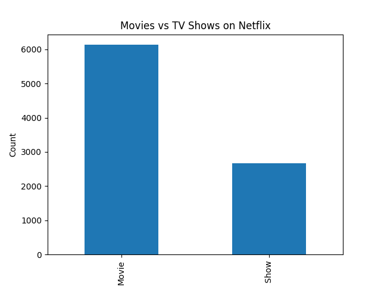
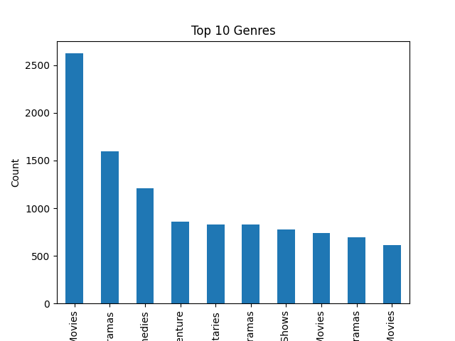
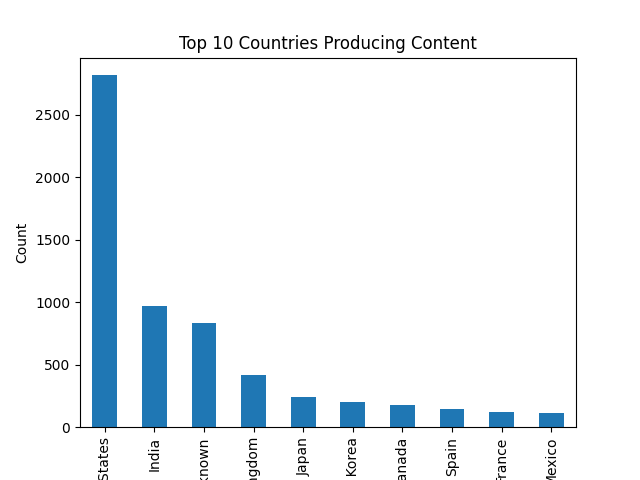
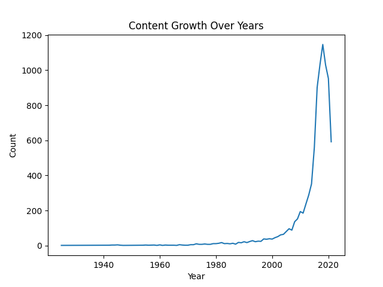
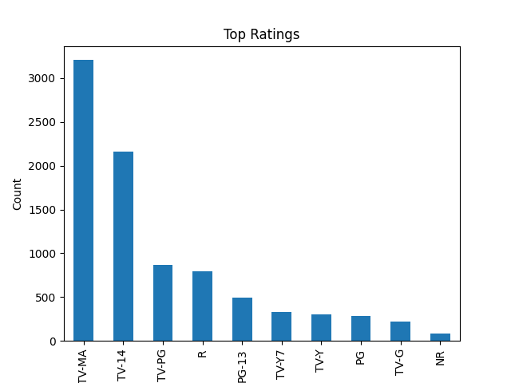

# 📊 Netflix Data Analysis
<<<<<<< HEAD

This project performs Exploratory Data Analysis (EDA) on Netflix dataset using Python.

---

## 🔍 Objectives
- Analyze Movies vs TV Shows distribution  
- Identify top genres  
- Country-wise content analysis  
- Content trend over the years  
=======
This project performs Exploratory Data Analysis (EDA) on Netflix Movies & TV Shows dataset using Python.

---

## 🔍 Objective
The goal of this project is to analyze Netflix content and extract meaningful insights such as:
- Distribution of Movies vs TV Shows  
- Most popular genres  
- Country-wise content production  
- Growth of content over the years  
- Ratings distribution  
>>>>>>> a0a61abe3259ca31e8f98081f72fda9f34eaac62

---

## 🛠️ Tech Stack
- Python  
- Pandas  
- Matplotlib  
<<<<<<< HEAD
- Seaborn  
=======

---

## 📁 Project Structure
netflix-data-analysis/
│
├── netflix_analysis.py
├── netflix_titles.csv
├── movies_vs_tvshows.png
├── top_genres.png
├── top_countries.png
├── content_growth.png
├── ratings.png
└── README.md

---

## 📊 Visual Insights

### Movies vs TV Shows


### Top Genres


### Top Countries


### Content Growth


### Ratings Distribution

>>>>>>> a0a61abe3259ca31e8f98081f72fda9f34eaac62

---

## 📈 Key Insights
<<<<<<< HEAD
- Movies are more than TV Shows on Netflix  
- USA has the highest content production  
- Drama and Comedy are the most popular genres  

---

## 📁 Dataset
Netflix dataset (CSV file)

---

## 🚀 Author
Shrishti Banshiar
=======
- Movies are more available than TV Shows on Netflix  
- United States produces the highest content  
- Drama and Comedy are the most popular genres  
- Content growth increased rapidly after 2015  

---

## ▶️ How to Run

1. Clone the repository:
   ``` git clone https://github.com/Shrishti1701/netflix-data-analysis.git```

2. Navigate to the folder:
   ```cd netflix-data-analysis```

3. Install dependencies:
   ```pip install pandas matplotlib```

4. Run the script:
   ```python netflix_analysis.py```

---

## 📌 Future Improvements
- Add interactive dashboards (Power BI / Tableau)  
- Deploy as a web app  
- Perform advanced machine learning analysis  

---

## 👩‍💻 Author
**Shrishti Banshiar**  
📧 shrishtibanshiar105@gmail.com  

---

⭐ If you like this project, consider giving it a star!
>>>>>>> a0a61abe3259ca31e8f98081f72fda9f34eaac62
